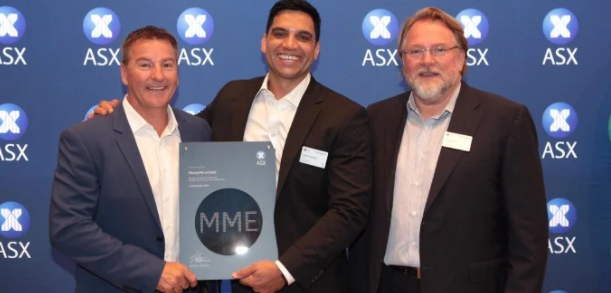
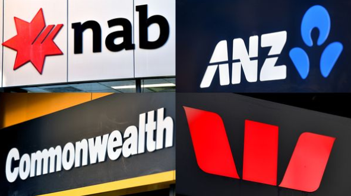

# Unit-1-Homework-Assignment-FinTech-Case-Study

# Unit 1 Homework - MoneyMe 

## Overview and Origin

* Name of company

    # MoneyMe 
    ## Banking & Finance 

    

* When was the company incorporated?
    * The company was incorporated on 09 May 2013

*Reference - https://investors.moneyme.com.au/investor-centre/?page=investor-fact-sheet*

* Who are the founders of the company?

    * The company was founded by Steve Bannigan, Clayton Howes, and Scott Emery. The idea comes to them over a casual discussion on how to service personal small-loans for the millennial markets in Australia.

*reference - https://www.smartcompany.com.au/lists/smart50-awards-2017/moneyme/*

* How did the idea for the company (or project) come about?

    * I have dealt with SocietyOne and Rate Setter in the past and have friends working in the Fintech industry and lending money to investors in the property industry. I found MoneyMe interesting because of its infrastructure and the range of products they offer, and the fact they are a listed company.

*reference - https://www.smartcompany.com.au/lists/smart50-awards-2017/moneyme/*

* How is the company funded? How much funding have they received?

    * MoneyMe raises capital from Private Equity Firms. The company has recently signed a new deal with Private Equity Partners (PEP) to raise $50mil over a four years agreement. The funding will be used to pay off an old loan facility of $22mil and expand its product offering to B2B and B2C, AutoPay, and MoenyMe+.MoneyMe kept the cost-of-funds ratio below 5%.  

*reference - https://www.theadviser.com.au/breaking-news/42086-moneyme-secures-50m-funding-commitment*

## Business Activities:

* What specific financial problem is the company or project trying to solve?

    * The company solves the bureaucratic process of personal loans that you can often find in big banks. MoneyMe says an AI-Driven solution enables loan applications to be completed and checked within minutes, providing a fast, seamless and cheaper loan application to savvy tech borrowers.  

*reference - https://www.smartcompany.com.au/lists/smart50-awards-2017/moneyme/*

* Who is the company's intended customer?  Is there any information about the market size of this set of customers?

    * MoneyMe targets millennials and tech-savvy borrowers looking to borrow up to $25,000 in personal loans. In addition, money CEO Clayton Howes says that the company services "Generation Now," basically the people who do not want to wait for days to receive their loan confirmation on credit card on the post. Recently, MoneyMe moved to the auto finance and POS industry to broaden its offering.

*reference - https://themarketherald.com.au/moneyme-asxmme-embracing-new-tech-for-scalable-lending-solutions-2021-12-22/*

* What solution does this company offer that their competitors do not or cannot offer? (What is the unfair advantage they utilize?)

    *   MoneyMe co-founders realized that the current personal loan providers are slow-moving corporate that the big four banks in Australia mostly represent. They have used machine learning to offer personal loans to millennial Australians to solve this problem, and they claim that loans can be approved within minutes!

*reference - https://themarketherald.com.au/moneyme-asxmme-embracing-new-tech-for-scalable-lending-solutions-2021-12-22/*

* Which technologies are they currently using, and how are they implementing them? (This may take a little bit of sleuthing–– you may want to search the company’s engineering blog or use sites like Stackshare to find this information.)

    * MoneyMe says it created its own Ai Technology, called Aiden. It also claims that the AI can predict customer behavior and adjust its risk management based on the information. The company CEO, Clayton Howes, says its AI provides an unfair advantage over competitors that rely on outdated data based on Equifax scores.

reference - https://themarketherald.com.au/moneyme-asxmme-embracing-new-tech-for-scalable-lending-solutions-2021-12-22/*

## Landscape:

* What domain of the financial industry is the company in?

    *   The company is currently in the Finance & Banking industry. Providing personal loans and now expending to auto finance, Buy now pay later, List Ready/Rent Ready and credit card provider.

*reference - https://hotcopper.com.au/threads/research.6233658/*

* What have been the major trends and innovations of this domain over the last 5-10 years?

    * 3 major technologies are impacting the banking sector at the moment  
    
    *     Artificial Intelligence - Major advantage of AI is that it can help with front, middle and back-office processing. AI can also improve the customer experience, risk management and generate revenue.

    *     DevOps - these are development platforms that are used in the banking industry for continued development, faster deliveries and better analytics.

    *     Ominichannel Strategies - Business communication channel used as a point of contact, including call centers, online platforms, and customer support.

*reference - https://www.linkedin.com/pulse/3-innovations-impact-banking-industry-2021-deborah-boyland*

* What are the other major companies in this domain?

    *   There are several personal loan providers in Australia, however, the major competitors to MoneyMe are *Harmoney, SocietyOne, lendup.com, rapidloans.com.au, credit24.com.au, financebuddha.com, walletwizard.com.auPlenti, and the big banks.*

*reference - https://mozo.com.au/top/personal-loans?mz_source=sem__Search&mz_cak=%2A%20Personal%20Loans%20%7C%20Phrase%20%7C%20Desktop__72324972184__personal%20loans%20finance&gclid=Cj0KCQiAlMCOBhCZARIsANLid6aqYJXMRIo0mjdCSoCHgkwiMeYedMaW-156G8RJLcorAsW-7nZ-ZvMaAp-YEALw_wcB*

*reference - https://rocketreach.co/moneyme-profile_b5fff8aef6742abd*

## Results

* What has been the business impact of this company so far?

    *   The company has provided innovation on the personal loan stage and has adjusted its offering and services to the "Generation Now," where consumers want to benefit on the same day.  

* What are some of the core metrics that companies in this domain use to measure success? How is your company performing, based on these metrics?

    *   Offer to consumers
    *   Funding costs 
    *   Average origination value 
    *   Loss provisions
    *   Returning customers 
    *   Operating cost

MoneyMe has performed as follow on these KPI's 

    *   Offer to consumers - Improved the customer pricing using the risk-adjusted models 
    *   Funding costs - decreased funding costs by 30.7%
    *   Average origination value - Increased by 39.6% to $8,200
    *   Loss provisions - decrease losses by 2.4% to 7.9%
    *   Returning customers - Increase of returning clients 
    *   Operating cost - decreased 10.8% of operating costs 

*reference - https://hotcopper.com.au/threads/research.6233658/*

* How is your company performing relative to competitors in the same domain?

    *   MoneyMe is one of the few companies in the sector that has achieved growth and is profitable. Most of the companies in the Fintech sector usually achieve growth but are not profitable.

*reference - https://www.afr.com/companies/financial-services/moneyme-harmoney-new-lending-up-as-digital-generation-seeks-credit-20210830-p58n1e*

## Recommendations

* If you were to advise the company, what products or services would you suggest they offer? (This could be something that a competitor offers, or use your imagination!)

    * I would recommend targeting a specific niche of individuals who are likely to repay their loan to companies, such as Doctors. Doctors have a long educational process but are likely to make substantial money and usually work with high integrity, making them a very desirable niche market for personal loans.

* Why do you think that offering this product or service would benefit the company?

    * As the company grows and expands its services, it also has more exposure for bad debt, so targeting a segmentation that is likely to pay back its loans is also time-poor and likely to take other product offerings.  

* What technologies would this additional product or service utilize?

    * Blockchain would be a good addition to the company technology, which would provide more transparency on the flow of money and leverage on the new technology trend, which is cryptocurrency. 

* Why are these technologies appropriate for your solution?

    *   The increased adoption of blockchain technology will provide more leverage to the company and offer different growth opportunities.